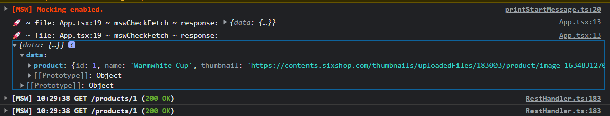

# Browser

<mark style="background-color:orange;">아래의 명령어를 안하고 한번 구성해보기</mark>

```bash
npx msw init public/ --save
```

./public

폴더가 없을수도 있음&#x20;

실제로 나도 없어서 ./dist 파일에 넣었음&#x20;

<mark style="background-color:orange;">이건 확인이 더 필요함</mark>&#x20;

추가로 package.json &#x20;

```json
  "dependencies": {
    "react": "^18.2.0",
    "react-dom": "^18.2.0",
    "react-kakao-maps-sdk": "^1.1.7",
    "react-lottie": "^1.2.3",
    "react-router-dom": "^6.9.0",
    "styled-components": "^5.3.9",
    "styled-reset": "^4.4.5"
  },
  "msw": {
    "workerDirectory": "public"
  }
```

<mark style="background-color:orange;">msw 세팅이 필요는 없는데 어떤때 필요한지 확인해볼 필요 있음</mark>


```bash
touch src/mocks/setup.ts
```

```typescript
import { setupWorker } from 'msw';
import { handlers } from './handlers';

export const worker = setupWorker(...handlers);
```


./src/main.tsx

```tsx
import React from 'react';
import { createRoot } from 'react-dom/client';
import { RouterProvider } from 'react-router-dom';
import { ReactRouterObj } from './routes/routes';

if (process.env.NODE_ENV === 'development') {
  const { worker } = require('./mocks/setup');
  worker.start();
}

const root = createRoot(document.getElementById('root') as HTMLElement);
root.render(
  <React.StrictMode>
    <RouterProvider router={ReactRouterObj} />
  </React.StrictMode>,
);

```


#### 연결 확인&#x20;

./src/App.tsx

```tsx
  useEffect(() => {
    (async function mswCheckFetch() {
      const response = await fetch('/products/1').then(res => res.json());
      console.log(
        '🚀 ~ file: App.tsx:19 ~ mswCheckFetch ~ response:',
        response,
      );
    })();
  }, []);
```

<figure><figcaption></figcaption></figure>

