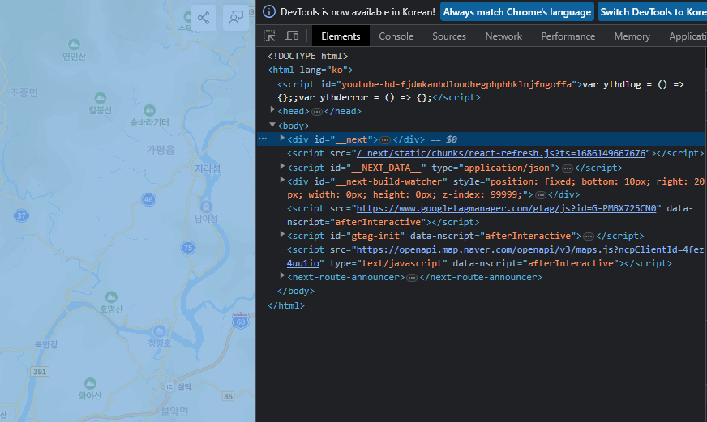

# global scss

### 100% 사용

이건 Next.js만의 문제는 아니고&#x20;

body에 vh, vw를 주면 보기에 자연스러워 보일 수 있는데&#x20;

모바일 기기나 예상치 못한 길이를 만나면 에러를 발생시킨다

실제로 프로젝트하면서 이거 때문에 전체 CSS를 다 수정해야했던 적이 있었다.

```scss
* {
  box-sizing: border-box;
  padding: 0;
  margin: 0;
}

html,
body {
  padding: 0;
  margin: 0;
  width: 100%;
  height: 100%;
}

@layer base {
  #__next {
    display: contents;
  }
}

a {
  color: inherit;
  text-decoration: none;
}
```


### \_next dom

<figure><figcaption></figcaption></figure>

이 친구는 내가 만든게 아닌데도 next에서 자체적으로만드는 dom이다.

이 친구는 우리가 컨트롤하기 어렵다.

그래서[ display: contents](https://developer.mozilla.org/ko/docs/Web/CSS/display#display\_contents)를 주어 브라우저상에서 box 요소를 없애준다.


이러고 바로 다음 태그인 main에서 width:100%; height: 100%를 주면 위의 \_\_next dom을 무시하고 body를 인식한다.
