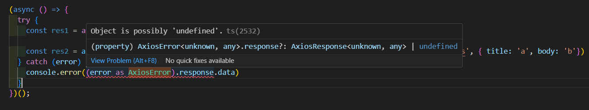

# AxiosError와 unknown error 대처법

axios error 처리가 상당히 어려운데

왜 어렵냐면 우리가 생각하기에 error는 axios error만 들어올거라고 생각하는데&#x20;

아니다. axios 에러 뿐만 아니라 기타 등등 (문법 오류 등)의 에러들이 다 포함되어 있기 때문에&#x20;

강의에서는 unknown

내가 실제로 실습했을때는 any

<figure><figcaption></figcaption></figure>

둘이 다르긴 하지만 위에서 언급되는 내용에는 크게 벗어나진 않는 듯 하다.

<figure><figcaption></figcaption></figure>

그래서 'ts는 건망증이 심하다' 편에서 제안했던 대로 as 를 통해서 너는 AxiosError야 라고 알려주기로 좀 아쉽지만 해결할 수 있음.


근데 여기에 unknown이 있을 수 있기 때문에 response에 data가 없을 수 있다.

<figure><figcaption></figcaption></figure>

옵셔널 체이닝까지 깔끔하게


근데 여기서 이렇게 하면 재사용이 안됨.

<figure><figcaption></figcaption></figure>

이런식으로 아래는 그대로 any.


그러니 변수에 담아서 재사용하는 방법도 있다. 아쉬운대로 이렇게 ...

```typescript
  } catch (error) {
    const errorResponse = (error as AxiosError).response;
    console.error(errorResponse?.data)
    errorResponse
  }
```

\=> 근데 이건치명적인 문제가 될 여지가 있는 코드임&#x20;

\=> error를 잡으려고 있는 catch 안에서 unknown 관련해 error가 발생한다면 신뢰성을 잃은 실패한 코드가 됨.

그래서 이 unknown을 해결하기 위한 두가지 방법을 제안

1. 커스텀 타입 가드

```typescript
  } catch (error) {
    if (error instanceof AxiosError) { // 커스텀 타입 가드
      console.error(error.response?.data)
    }
  }
```

\=> 이게 가능한 이유는 AxiosError가 클래스로 되어 있어서 js가 되고도 남아있다.


2. axios에서 제공해주는 type 가드드

```typescript
  } catch (error) {
    if (axios.isAxiosError(error)) { // 커스텀 타입 가드
      console.error(error.response?.data)
    }
  }
```

\=> 이걸로도 충분히 괜찮다.

\=> 하지만 data를 찍어보면 unknown이 뜨는데 이걸 해결하고 싶다... ?


.png>)

\=> 그런데 뒤져보니까 별도 제네릭은 구비되어 있지 않음.

```typescript
  } catch (error) {
    if (axios.isAxiosError(error)) { // 커스텀 타입 가드
      // {message: '서버 장애입니다. 다시 시도해주세요'}
      console.error((error.response as AxiosResponse<{message: string}>)?.data.message )
    }
  }
})();
```

최종적으로 message 에 string이 도출 구비.


일단 최대한 as 를 없애는 방법을 고민해보자.....


